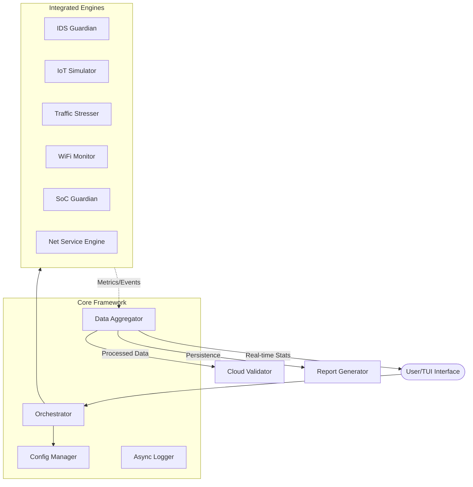
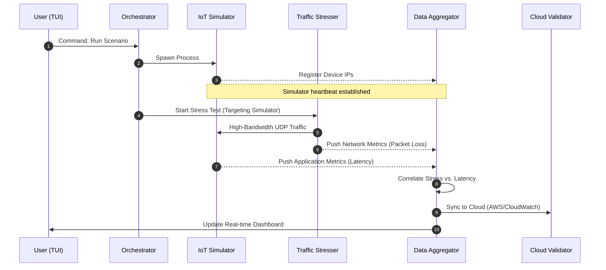

# 🏗️ Aegis NetValid Core Architecture

## Overview
Aegis NetValid Core is designed with a **Modular, Engine-Driven Architecture**. The primary design philosophy is to decouple the control logic (Orchestrator) from the execution logic (Engines) and the data processing logic (Aggregator), ensuring high scalability and fault isolation.

## High-Level System Design
The following diagram illustrates the relationship between the core components and the external environment.

---

## Component Breakdown

### 1. Orchestrator (The Brain)
The Orchestrator manages the entire system lifecycle using a **Non-blocking Process Management** model.
- **Process Isolation**: Each engine is spawned as an independent OS process using Python's `multiprocessing` to bypass the Global Interpreter Lock (GIL).
- **Interlock Logic**: Ensures dependencies are met (e.g., the `IDS` must be healthy and capturing before the `Traffic Stresser` begins).
- **State Synchronization**: Uses shared memory or Inter-Process Communication (IPC) to monitor engine health in real-time.

### 2. Data Aggregator (The Hub)
Acting as the central nervous system, the Aggregator handles high-throughput data streams.
- **Unified Timestamping**: Normalizes events from different engines onto a single timeline to enable accurate correlation analysis (e.g., matching a latency spike with a specific DDoS attack).
- **Async Buffering**: Uses `asyncio.Queue` to ingest data from engines without introducing backpressure to the testing logic.

### 3. Engine Layer
Engines are autonomous units designed to perform specific validation tasks. They follow a standardized interface (`start`, `stop`, `get_status`), making the framework easily extensible.

---

## Data Flow & Interaction
The sequence below demonstrates a typical **Automated Validation Scenario**: Launching a Simulator and then triggering a Stress Test while monitoring performance.

## Reliability & Resilience
- **Fault Isolation**: A crash in a specific engine (e.g., Scapy buffer overflow in the Stresser) will not terminate the Orchestrator or other monitoring engines.
- **Graceful Teardown**: Upon exit, the Orchestrator ensures all child processes are terminated and the Data Aggregator flushes all remaining buffers to the `outputs/` directory to prevent data loss.