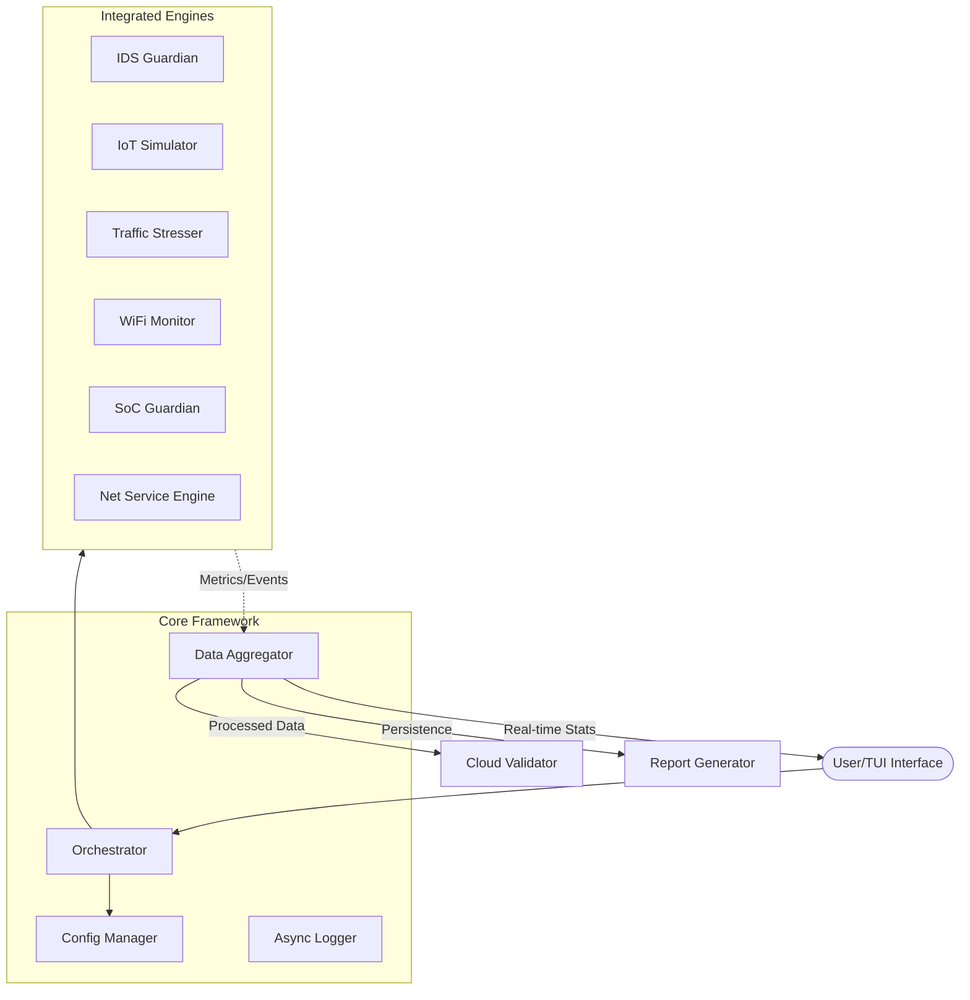
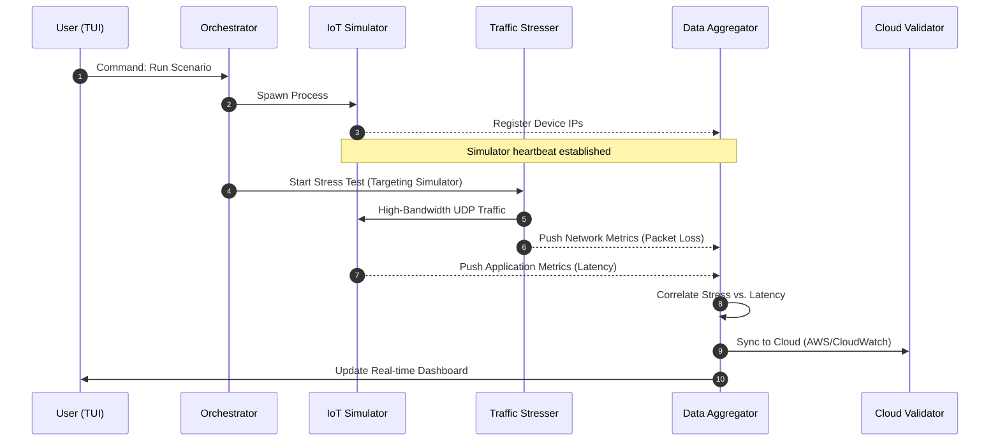

# 🏗️ Aegis NetValid Core Architecture

## Overview
Aegis NetValid Core is designed with a **Modular, Engine-Driven Architecture**. The primary design philosophy is to decouple the control logic (Orchestrator) from the execution logic (Engines) and the data processing logic (Aggregator), ensuring high scalability and fault isolation.

## High-Level System Design
The following diagram illustrates the relationship between the core components and the external environment.

```mermaid
graph TD
    User([User/TUI Interface]) --> Orchestrator
    
    subgraph Core_Framework [Core Framework]
        Orchestrator[Orchestrator]
        Config[Config Manager]
        Aggregator[Data Aggregator]
        Logger[Async Logger]
    end

    Orchestrator --> Config
    Orchestrator --> Engines
    
    subgraph Engines [Integrated Engines]
        IDS[IDS Guardian]
        Sim[IoT Simulator]
        Stress[Traffic Stresser]
        WiFi[WiFi Monitor]
        SoC[SoC Guardian]
        NetSvc[Net Service Engine]
    end

    Engines -.->|Metrics/Events| Aggregator
    Aggregator -->|Processed Data| Cloud[Cloud Validator]
    Aggregator -->|Real-time Stats| User
    Aggregator -->|Persistence| Reports[Report Generator]
```

---

## Component Breakdown

### 1. Orchestrator (The Brain)
The Orchestrator manages the entire system lifecycle using a **threading-based concurrency** model.
- **Concurrent Execution**: Each engine runs on its own daemon `threading.Thread`, so blocking work (packet capture, iperf3 streaming) doesn't stall the TUI or the other engines. Engines share the Orchestrator's process and interpreter — this gives logical isolation (an uncaught exception in one engine's thread won't crash the others) but not OS-level process isolation, and it does not bypass the GIL.
- **Ordered Startup**: Engines are started in a fixed priority order (`WiFi → IDS → Simulator → Stresser`) in `Orchestrator.start_all()`. A failure in one engine's `start()` is caught and logged rather than aborting the rest of the sequence — there is currently no health-gate that waits for a prior engine to be confirmed ready before the next one starts.
- **State Synchronization**: `get_system_health()` polls each engine's `is_running` flag (or thread liveness) on demand. There is no shared-memory or IPC layer.

### 2. Data Aggregator (The Hub)
Acting as the central nervous system, the Aggregator normalizes engine output into one timestamped snapshot per poll.
- **Unified Timestamping**: `collect_all_metrics()` stamps a single `time.time()` across every engine's `get_report()` output, so metrics from different engines can be correlated on one timeline (e.g., matching a latency spike with a specific DDoS attack).
- **Synchronous Polling**: The main TUI loop calls `collect_all_metrics()` directly on each render tick; a rolling in-memory history (last 100 snapshots) backs `get_latest_summary()` for the Cloud Validator and report generator.

### 3. Engine Layer
Engines are autonomous units designed to perform specific validation tasks. They follow a standardized interface (`start`, `stop`, `get_report`), making the framework easily extensible.

---

## Data Flow & Interaction
The sequence below demonstrates a typical **Automated Validation Scenario**: Launching a Simulator and then triggering a Stress Test while monitoring performance.

```mermaid
sequenceDiagram
    autonumber
    participant U as User (TUI)
    participant O as Orchestrator
    participant S as IoT Simulator
    participant T as Traffic Stresser
    participant A as Data Aggregator
    participant C as Cloud Validator

    U->>O: Command: Run Scenario
    O->>S: Spawn Process
    S-->>A: Register Device IPs
    Note over S,A: Simulator heartbeat established
    
    O->>T: Start Stress Test (Targeting Simulator)
    T->>S: High-Bandwidth UDP Traffic
    
    T-->>A: Push Network Metrics (Packet Loss)
    S-->>A: Push Application Metrics (Latency)
    
    A->>A: Correlate Stress vs. Latency
    A->>C: Sync to Cloud (AWS/CloudWatch)
    A->>U: Update Real-time Dashboard
```

## Reliability & Resilience
- **Fault Isolation (logical, not OS-level)**: An uncaught Python exception inside one engine's thread will not crash the Orchestrator or the other engines, since each engine's `start()` call is wrapped independently. This is thread-level isolation, not process-level — engines share one interpreter and address space, so a native-level crash (e.g. a segfault inside a C extension such as libpcap) can still take down the whole process. Moving engines to `multiprocessing.Process` for true process isolation is a tracked improvement, not yet implemented.
- **Graceful Teardown**: Upon exit, the Orchestrator calls `stop()` on every engine to signal its thread to exit, and the Report Core flushes the latest data to the `outputs/` directory before the process ends.