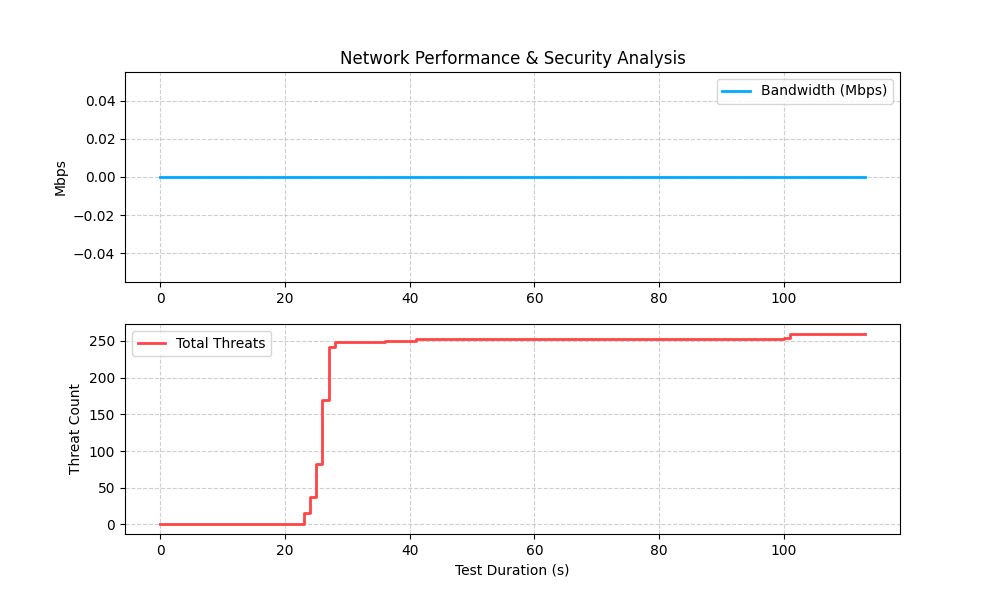

# Aegis NetValid Test Report
**Generated Time**: 2026-04-04 15:50:12
**Gateway**: 192.168.0.1

## 1. Traffic Statistics Charts

## 2. Threat Detection Summary
- **Final Threat Count**: 260
- **Current Security Status**: CLEAR

## 3. System Statistics
- **Total Samples Collected**: 114
- **Peak Bandwidth**: 0.0 Mbps
